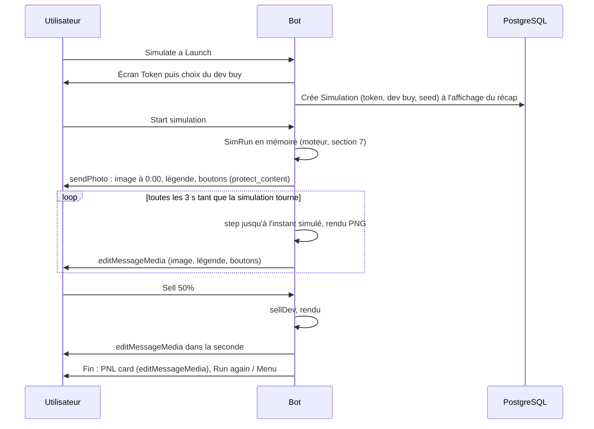

# Launch Bot — Contexte projet

Document de contexte pour développer le bot. Projet perso, sur devnet uniquement.
Dernière mise à jour : 24/09/2026.

## 1. Vue d'ensemble

Launch Bot est un bot Telegram pour créer un memecoin sur Solana via pump.fun. Il propose aussi une simulation de launch en direct, jouée dans le chat : le bot édite l'image du graphique en direct, avec les boutons de vente en dessous (décision du 24/09/2026, voir 6.5).

Le projet avance en deux versions. La V1 couvre tout le parcours jusqu'à la création du token : menus, wallets, abonnement, générateur de token et simulation. La V2 ajoute la création réelle du token sur pump.fun.

Le bot est ouvert à tous, en conversation privée uniquement. Il tourne sur devnet et tourneras une fois les test fini sur mainnet. L'interface du bot est en anglais. Chaque écran affiche une description et des infos au-dessus des boutons (voir 4.5). Ce document est en français.

## 2. Périmètre

| Fonctionnalité | V1 | V2 |
|---|:---:|:---:|
| Premier accès : acceptation des Terms et adhésion au canal du bot | ✅ | |
| Écran d'accueil et menu principal | ✅ | |
| Support (compte support, priorité Premium), Terms of Service, Privacy Policy, commandes admin | ✅ | |
| Wallets : créer, importer (clé ou seed phrase), renommer, supprimer, retirer des SOL | ✅ | |
| Subscribe : Classic et Premium, pass 2 jours ou 1 mois, paiement en SOL | ✅ | |
| Générateur de token | ✅ | |
| Simulate a Launch : simulation live dans le chat, ventes du dev, PNL card | ✅ | |
| Launch Coin : conditions, écran Token, récap | ✅ | |
| Launch Coin : création réelle via pump.fun | | ✅ |
| Launch Coin : My launches et vente des tokens du dev | | ✅ |
| Canaux : annonces et posts manuels | ✅ | |
| Canal Succès : format du post | ✅ | |
| Canal Succès : post automatique après un launch | | ✅ |

Hors périmètre :

| Élément | Raison |
|---|---|
| Stats et Referrals | Retirés du menu |

## 3. Canaux Telegram

| Canal | Rôle |
|---|---|
| Canal du bot | Canal principal du projet, à rejoindre pour accéder au bot (voir 4.2). Il publie aussi les annonces, les promotions et des avis d'utilisateurs. Les avis viennent de vrais utilisateurs, publiés avec leur accord et sans modification. |
| Succès | Post automatique de chaque launch confirmé, en V2 (format en 10.4). Chaque post indique le réseau (devnet). Une simulation n'y est jamais présentée comme un vrai launch. |
| Annonces | Annonces officielles : nouveautés, maintenance, changements d'offres. Publication avec `/announce` (voir 11.4), qui peut aussi relayer le message dans le canal du bot. |

Le bot doit être administrateur des trois canaux. C'est nécessaire pour y publier et pour vérifier qu'un utilisateur est membre (`getChatMember`). Les identifiants et les liens publics des canaux sont dans les variables d'environnement.

## 4. Accueil et menu principal

### 4.1 Accès

Le bot est ouvert à tous. Il fonctionne uniquement en conversation privée : dans un groupe ou un canal, il n'exécute aucune action. Ça évite toute action sur un wallet en public. La commande `/start` ouvre l'accueil.

Comme le bot est public, chaque utilisateur est limité en fréquence (clics, Generate, simulations, retraits) pour éviter les abus.

### 4.2 Premier accès

Avant de voir le menu, un nouvel utilisateur passe par deux écrans : l'acceptation des Terms, puis l'adhésion au canal du bot.

Écran 1, Terms :

```
🚀 Welcome to Launch Bot

Create and simulate Solana memecoin launches, right from Telegram.

ℹ️ This bot runs on Solana.

Before you start, please read and accept our Terms of Service and Privacy Policy.

[ 📜 Terms of Service ][ 🔒 Privacy Policy ]
[ ✅ I accept                             ]
```

Les deux premiers boutons ouvrent les pages `/terms` et `/privacy` dans Telegram, en web app (boutons `web_app`). « I accept » enregistre la version des Terms (`TERMS_VERSION`) et la date. Si la version change, cet écran revient au prochain passage.

Écran 2, canal :

```
📢 ONE LAST STEP · 🧪 Devnet

Join our channel to follow updates and new features.

[ 📢 Join channel                          ]
[ ✅ I've joined                           ]
```

« Join channel » ouvre le lien du canal. « I've joined » vérifie l'adhésion avec `getChatMember`. Les statuts acceptés sont `member`, `administrator` et `creator`, ainsi que `restricted` si `is_member` est vrai. Sinon, une alerte s'affiche : « You haven't joined the channel yet. » L'écran ajoute aussi la ligne « ℹ️ Not joined yet. Join the channel, then tap I've joined. »

L'adhésion est re-vérifiée à chaque `/start` avec un cache de 10 minutes, et sans cache à l'entrée de Launch Coin, puis juste avant la création en V2. Si l'utilisateur a quitté le canal, l'écran 2 revient. Avant un launch, il affiche en plus la note « 🚀 Join the channel to launch a coin. », et le parcours reprend après « I've joined ».

### 4.3 Écran d'accueil

Exemple pour un utilisateur avec deux wallets et sans abonnement :

```
🚀 LAUNCH BOT · 🧪 Devnet

👤 ACCOUNT
┌ @username
├ 🆔 123456789
├ ⭐ No subscription
└ 👛 2 wallets · 4.250 SOL ($439.28)

👥 COMMUNITY
┌ 📣 Announcements
├ 🏆 Success
├ 📢 Bot channel · 1,248 members
└ 767 active subscribers

📈 SOL $103.36

➡️ Subscribe to unlock Launch Coin.

🕒 Updated 14:32 UTC
```

| Ligne | Affichage selon l'état |
|---|---|
| Nom | `@username`, ou le prénom si l'utilisateur n'a pas de username |
| ID | ID Telegram en `<code>`, copiable d'un tap |
| Abonnement | Aucun : `⭐ No subscription`. Actif : `⭐ Premium · 1d 4h left` s'il reste moins de 72 h, sinon `⭐ Premium · until 12 Oct`. Expiré : `⭐ Classic ⚠️ expired`. |
| Wallets | Aucun : `👛 No wallet yet`. Sinon : nombre de wallets, solde total en SOL et en USD. |
| Communauté | Liens nommés vers les trois canaux |
| Abonnés | Toujours affiché. Nombre réel d'utilisateurs avec un abonnement actif, calculé depuis la base. |
| Membres du canal | Toujours affiché. Nombre de membres du canal du bot, lu avec `getChatMemberCount`. |
| Prix SOL | Prix en USD. Si l'API ne répond pas, dernier prix connu s'il a moins de 10 min. Sinon `📈 SOL —` et tous les montants USD sont masqués. |
| Prochaine étape | Selon le tableau ci-dessous |

La ligne « prochaine étape » suit cet ordre de priorité :

| Situation | Ligne affichée |
|---|---|
| Aucun wallet | `➡️ Create a wallet to get started.` |
| Pas d'abonnement actif | `➡️ Subscribe to unlock Launch Coin.` |
| Aucun wallet avec au moins 1 SOL + la marge de frais | `➡️ Fund a wallet to launch a coin.` |
| Tout est prêt | `✅ You're all set.` |

Le message est en HTML (`parse_mode: HTML`), avec les titres en gras et les aperçus de liens désactivés. Au `/start`, le bot envoie un nouveau message. Au retour vers le menu (Back ou Menu), il édite le message existant.

| Donnée | Source | Cache |
|---|---|---|
| Soldes | Un seul appel `getMultipleAccountsInfo` pour tous les wallets de l'utilisateur | 30 s par utilisateur |
| Prix SOL/USD | API de prix, fournisseur à choisir | 60 s, partagé |
| Compteur d'abonnés | Requête en base sur les abonnements actifs | 60 s, partagé |
| Membres du canal | `getChatMemberCount` sur le canal du bot | 10 min, partagé |

### 4.4 Menu principal

Même disposition que la maquette, sans Stats ni Referrals. Le clavier inline s'affiche sous l'écran d'accueil :

```
[ 🚀 Launch Coin                             ]
[ 📊 Simulate a Launch                       ]
[ ⭐ Subscribe                               ]
[ 👛 Wallets          ][ 🆘 Support          ]
[ 📜 Terms of Service ][ 🔒 Privacy Policy   ]
[ 🔄 Refresh                                 ]
```

La navigation édite un seul message « écran » au lieu d'en envoyer un nouveau à chaque clic. Chaque sous-écran a un bouton « ⬅️ Back », et les écrans profonds ont aussi « 🏠 Menu ». Les callback data sont courtes et préfixées par domaine (exemple : `wal:del:<id>`). Telegram les limite à 64 octets.

« Terms of Service » et « Privacy Policy » sont des boutons `web_app` : les pages s'ouvrent dans Telegram. « 🔄 Refresh » recharge les soldes sans passer par leur cache, au plus une fois toutes les 10 s par utilisateur. Le prix garde son cache partagé de 60 s. Si rien n'a changé, Telegram refuse l'édition (« message is not modified ») : le bot affiche alors la notification « Already up to date ».

### 4.5 Règles d'affichage communes

Aucun écran ne montre seulement des boutons, quel que soit le menu, la section ou l'étape. Au-dessus du clavier, chaque écran affiche, dans cet ordre :

| Bloc | Contenu |
|---|---|
| En-tête | Nom de l'écran ou du parcours, badge `🧪 Devnet` pendant le developpement en devnet et enlevé une fois en main net. Dans un parcours : compteur d'étape et barre de progression (voir 5). |
| Description | Une ou deux phrases : à quoi sert l'écran et ce que l'utilisateur doit faire |
| Infos | L'état utile pour décider : soldes, choix déjà faits, offre active, montants, frais |
| Flags | Tout blocage ou avertissement, écrit en clair (`⚠️ Insufficient funds`, `⚠️ Missing image`, `🔒 Premium only`), avec le nom de l'objet concerné (wallet, champ, offre) et ce qui manque |

Une alerte Telegram (notification au clic) ne remplace jamais une info à l'écran : elle sert seulement de retour rapide. Quand un clic est bloqué, le bot met aussi à jour le texte de l'écran avec le flag. Les écrans de saisie affichent la valeur actuelle et les règles à respecter (longueur, format, bornes).

| Cas | Affiché au-dessus des boutons |
|---|---|
| Canal pas encore rejoint (4.2) | `ℹ️ Not joined yet. Join the channel, then tap I've joined.` |
| Refresh (4.4, 9.2) | Ligne `🕒 Updated 14:32 UTC` |
| Continue avec une info manquante (5) | `⚠️ Missing: name, ticker` |
| AI Generate sans Premium (5) | `🔒 AI Generate: Premium only` |
| AI Generate sans fournisseur IA branché (5, 8.1) | `🤖 AI model coming soon: AI Generate uses the standard generator for now.` |
| Wallet aux fonds insuffisants (8.3, 10.1) | Ligne du wallet avec `⚠️ Insufficient funds` et le montant manquant |
| Dev buy trop élevé (10.1) | Note avec le nom du wallet, `⚠️ Insufficient funds` et le montant manquant |
| Paiement pas encore détecté (8.3) | `⏳ Waiting for payment · last check 14:32 UTC` |
| Offre Classic pendant un Premium actif (8.4) | `Classic: available when your Premium ends` |
| Limite de wallets atteinte (9.3) | Compteur `2/5` dans l'en-tête de la liste, avec `limit reached` à la limite |
| Create token en V1 (10.1) | `🚧 Token creation arrives in V2.` sur le récap |
| Frais de vente insuffisants (10.3) | Note avec le nom du wallet, `⚠️ Insufficient funds` et le montant manquant |

## 5. Générateur de token

Cet écran sert à Simulate a Launch et à Launch Coin. Le bouton « 🎲 Generate » propose un nouveau token complet à chaque clic. L'utilisateur ajoute ensuite l'image et les liens, puis valide avec « ➡️ Continue ».

```
📊 SIMULATION · STEP 1/3 · 🧪 Devnet
▰▱▱
Token › Dev buy › Recap

Generate a token or edit it. Image and links are optional.

🪙 TOKEN
┌ Name: Moon Otter
├ Ticker: $OTTR
├ Description: An otter who loves the stars.
├ 🖼 Image: ✅ Added
├ 🌐 Website: —
├ 🐦 X: —
└ ✈️ Telegram: —

🔒 AI Generate: Premium only

[ 🎲 Generate         ][ 🔒 AI Generate      ]
[ ✏️ Edit                                    ]
[ 🖼 Image            ][ 🌐 Website          ]
[ 🐦 X                ][ ✈️ Telegram         ]
[ ⬅️ Back             ][ ➡️ Continue         ]
```

Règle commune à tous les parcours : chaque écran commence par un en-tête avec le nom du parcours, un compteur d'étape (`STEP 1/3`) et une barre de progression avec le nom des étapes. Vient ensuite un résumé écrit des choix déjà faits, puis le clavier. Le compteur dépend du parcours : 3 étapes pour la simulation, 4 pour le launch (voir 10.1).

| Bouton | Comportement |
|---|---|
| 🎲 Generate | Nouveau token local. Remplace le nom, le ticker et la description, garde l'image et les liens. |
| 🤖 AI Generate | Premium, 50 par jour. En V1, le bouton est actif mais utilise le générateur local, en attendant un fournisseur IA. L'écran l'indique : « 🤖 AI model coming soon: AI Generate uses the standard generator for now. » Une fois l'IA branchée : nom, ticker, description et logo, et la mention disparaît. Sans Premium, le bouton s'affiche « 🔒 AI Generate » et un clic ouvre l'alerte « 🔒 AI Generate is a Premium feature. » |
| ✏️ Edit | Choix du champ : « Name », « Ticker », « Description », puis « ❌ Cancel ». Chaque champ ouvre une saisie avec « ❌ Cancel », avec les mêmes règles de longueur. |
| 🖼 Image, 🌐 Website, 🐦 X, ✈️ Telegram | Saisie avec « ❌ Cancel ». Un champ déjà rempli propose aussi « 🗑 Remove ». |
| ⬅️ Back | Retour au menu (simulation) ou à l'étape précédente (launch) |
| ➡️ Continue | Étape suivante. Si le nom ou le ticker manque, alerte « Add a name and ticker first. » |

| Champ | Source | Règle |
|---|---|---|
| Nom | Généré, modifiable | 32 octets max (attention aux emojis) |
| Ticker | Généré, modifiable | 10 octets max, en majuscules |
| Description | Générée, modifiable | 1 à 3 phrases courtes |
| Image | Utilisateur | Envoyée en photo ou en fichier. On stocke le `file_id` Telegram. Optionnelle, en simulation comme au launch. |
| Site web | Utilisateur | Optionnel. URL en `https://`. |
| X (Twitter) | Utilisateur | Optionnel. Handle ou URL, normalisé. |
| Telegram | Utilisateur | Optionnel. Lien `t.me`, normalisé. |

Les limites de 32 et 10 octets viennent de Metaplex, utilisé par l'ancienne instruction `create`. La V2 utilise `create_v2`, avec des métadonnées Token-2022 : on garde ces limites dans l'interface, et on vérifie celles de `create_v2` dans la doc de création de pump.fun. Telegram ne permet pas de griser un bouton : tant que le nom et le ticker manquent, « Continue » affiche une alerte au lieu d'avancer. Le générateur local (listes de mots et modèles de phrases) sert à tout le monde. Les abonnés Premium ont aussi un générateur IA (voir 8.1).

## 6. Simulate a Launch (V1, gratuit)

La simulation est accessible sans abonnement. Elle se joue **entièrement dans le chat** : un message du bot porte l'image du graphique, rééditée à intervalle régulier, avec les boutons de vente en dessous. À la fin, la PNL card remplace l'image de ce même message. Décision du 24/09/2026 : la Mini App de simulation est abandonnée (voir 6.5).

| Étape | Écran | Clavier |
|---|---|---|
| 1/3 | Token | Voir section 5 |
| 2/3 | Dev buy | `[ 3 SOL ][ 5 SOL ][ 10 SOL ]`, puis `[ ✏️ Custom ]`, puis `[ ⬅️ Back ]`. Custom demande un montant de 1 à 20 SOL, avec « ❌ Cancel ». |
| 3/3 | Récap | `[ ▶️ Start simulation ]` (bouton callback), puis `[ ⬅️ Back ][ 🏠 Menu ]` |
| — | Message de simulation | Image du graphique éditée toutes les 3 secondes, légende avec chrono, market cap et position, boutons Sell et contrôles (6.1, 6.2) |
| — | Fin | La PNL card remplace l'image du message de simulation (6.3) |

Écran Dev buy :

```
📊 SIMULATION · STEP 2/3 · 🧪 Devnet
▰▰▱
Token › Dev buy › Recap

🪙 Moon Otter · $OTTR
💰 Dev buy: not selected yet

How much SOL should the dev buy at launch?

[ 3 SOL      ][ 5 SOL      ][ 10 SOL     ]
[ ✏️ Custom                                ]
[ ⬅️ Back                                  ]
```

Écran Récap :

```
📊 SIMULATION · STEP 3/3 · 🧪 Devnet
▰▰▰
Token › Dev buy › Recap

🪙 TOKEN
┌ Moon Otter · $OTTR
├ An otter who loves the stars.
├ 🖼 Image: ✅
└ 🔗 Links: none

💰 Dev buy: 5 SOL (≈ 15.2% of supply)
⏱ Duration: 3 min max

⚠️ DEMO — Bullish scenario. Not a prediction or a real result.

[ ▶️ Start simulation                      ]
[ ⬅️ Back             ][ 🏠 Menu            ]
```

Le rendu est une image PNG produite côté serveur (bougies et histogramme de volume), envoyée en photo puis remplacée par `editMessageMedia` à chaque image. Telegram limite la fréquence des éditions : une image toutes les 3 secondes (`SIM_FRAME_MS`, proposition), et jamais deux éditions du même message à moins d'une seconde d'écart. Le rendu n'est pas fluide comme un graphique web : c'est le compromis assumé pour rester dans le chat, comme le font les bots de trading.

**Exigence : mention de démonstration.** La légende du message de simulation commence par `⚠️ DEMO — Bullish scenario. Not a prediction or a real result.` à chaque édition ; les images (graphique et PNL card) n'en portent pas, la légende suffit (décision du 24/09/2026 ; la PNL card garde « SIMULATION · Not a real result » en bas). Le récap qui précède affiche la même mention.

### 6.1 Message de simulation

```
┌──────────────────────────────────────────┐
│ DEMO — Bullish scenario. Not a prediction │
│ Moon Otter · $OTTR            ⏱ 1:32 / 3:00 │
│                                            │
│      ▮▮  ▮        bougies 5 s              │
│    ▮    ▮ ▮▮▮     axe : market cap (USD)   │
│  ▂▃ ▅▂▃▂▅▃        volume                   │
│  0:00   0:30   1:00   1:30                 │
└──────────────────────────────────────────┘
📊 SIMULATION · 🧪 Devnet
⚠️ DEMO — Bullish scenario. Not a prediction or a real result.

🪙 Moon Otter · $OTTR
⏱ 1:32 / 3:00 · Speed x2

📈 Market cap: $5,175.82 (50.08 SOL)
Bonding curve: 34.2% ▰▰▰▱▱▱▱▱▱▱
Volume: 18.402 SOL · Buys / Sells: 214 / 97

💼 You hold: 96.66M OTTR (9.67%)
Value if sold now: ≈ 3.412 SOL ($352.66)
PnL: +0.412 SOL (+13.7%)

[ Sell 25%    ][ Sell 50%    ][ Sell 100%   ]
[ ⏸ Pause     ][ x1 ][ ✓ x2 ][ x5 ]
```

| Bloc | Contenu |
|---|---|
| Image | 1280 × 720 px, PNG. Nom · ticker et chrono en en-tête, bougies et histogramme de volume, axe des valeurs en **market cap en USD** (en SOL si le prix SOL est inconnu), axe du temps en `m:ss` simulé. Logo du token en en-tête s'il existe, sinon pastille avec la première lettre du ticker (proposition). |
| Légende | 1 024 caractères au plus : en-tête, mention DEMO, token, chrono et vitesse, stats (market cap en USD et en SOL, progression de la bonding curve, volume cumulé, achats et ventes), position (6.2). Sans prix SOL, aucun montant USD. |
| Boutons | « Sell 25% », « Sell 50% », « Sell 100% » ; « ⏸ Pause » ↔ « ▶️ Resume » ; vitesse x1, x2 ou x5, la vitesse courante cochée. Vitesse par défaut x2 (proposition) : 3 minutes simulées en 90 secondes réelles. |

Par rapport à la Mini App, le bloc Top holders disparaît de la V1 (le moteur garde `topHolders` pour la V2), ainsi que le prix par token et le bloc Token détaillé (description et liens restent sur le récap).

Règles :

| Règle | Détail |
|---|---|
| Une simulation à la fois | Une seule simulation active par utilisateur (proposition). Start pendant une simulation en cours : alerte « A simulation is already running. » (texte proposé). |
| Charge | `SIM_MAX_ACTIVE` simulations actives dans le process (proposition : 20). Au-delà, le récap affiche le flag « ⚠️ The simulator is busy. Try again in a minute. » (texte proposé) et rien ne démarre. |
| Cadence | Une édition toutes les `SIM_FRAME_MS` (3 s) ; une vente ou un changement de vitesse provoque une édition immédiate, au plus une par seconde par message. |
| Pause | Aucun pas du moteur, le chrono est figé. Après 10 minutes de pause sans clic (proposition), la simulation se termine et la PNL card s'affiche. |
| Redémarrage du bot | L'état vit en mémoire : les simulations en cours sont perdues, leur message reste figé. Un clic sur ses boutons répond « This simulation is over. Start a new one from the menu. » (texte proposé). |
| Partage | Le message est envoyé avec `protect_content` : ni transfert ni enregistrement depuis Telegram. |

### 6.2 Position et ventes

La position de départ correspond aux tokens achetés au dev buy. Chaque vente passe par la formule de la bonding curve (section 7.1), impact de prix et frais inclus. Vendre une grosse position fait donc baisser le prix, comme en vrai.

La valeur « si vendu maintenant » se calcule de la même façon, et non en multipliant le prix affiché par le nombre de tokens. Le PnL vaut : SOL reçus des ventes + valeur si vendu maintenant − SOL dépensés au dev buy (frais inclus).

Un tap sur Sell passe par le bot : la vente s'applique à l'instant simulé courant, en cours comme en pause, puis l'image et la légende sont rééditées dans la seconde. Un second tap dans la même seconde est ignoré avec une alerte (un tap = une vente). « Sell 100% » ferme la position et termine la simulation ; il déclenche aussi la panique des autres détenteurs, qui revendent 90 % de leurs tokens au même instant, les plus gros d'abord (`DEV_DUMP_PANIC_SHARE`, proposition du 24/09/2026) : la dernière bougie retombe près du market cap de lancement, comme après un rug. La courbe ne descend jamais sous ce niveau (≈ 28 SOL de market cap, soit 3 200 $ à 116 $ le SOL).

### 6.3 Fin de simulation et PNL card

La simulation s'arrête dans trois cas : 3 minutes simulées écoulées, 100 % de la position vendue, ou bonding curve complète. Le dernier état est d'abord dessiné (la bougie de la vente de clôture, quand il y en a une) et reste 2 secondes ; puis la PNL card remplace l'image du message de simulation (`editMessageMedia`) sous forme d'**animation** (un MP4 muet que Telegram joue en boucle : la carte est dessinée par-dessus un clip d'animation, décision du 24/09/2026), la légende devient le résumé et les boutons deviennent « Run again » et « Menu ».

```
╭──────────────────────────────────────╮
│ $OTTR                           (🖼) │  ← ticker, logo du token
│ [ ≡ +1.283 ]                          │  ← pastille verte (rouge en perte), montant en SOL
│                                      │     (le clip d'animation en fond)
│ PNL          +42.7%                  │
│ Invested     ≡ 3.000                 │
│ Position     ≡ 4.283                 │
│ SIMULATION · Not a real result       │
╰──────────────────────────────────────╯
📊 SIMULATION ENDED · 🧪 Devnet
⚠️ DEMO — Bullish scenario. Not a prediction or a real result.

🪙 $OTTR | +42.7%
📈 Invested: 3.000 SOL ($310)
📉 Sell: 4.283 SOL ($443)
💰 Profit: +1.283 SOL ($133)

[ 🔁 Run again        ][ 🏠 Menu ]
```

| Élément | Règle |
|---|---|
| PnL | Sur la carte : le montant en SOL (3 décimales, signé) sur la pastille, le pourcentage sur la ligne PNL ; le glyphe Solana remplace le mot SOL. Dans la légende : en % et en SOL, avec la valeur en USD si le prix SOL est connu. Vert si positif, rouge si négatif. |
| Invested / Position | Le dev buy, et ce que la position a rapporté (vendu + le reste valorisé comme vendu à la fin), arrondis à 3 décimales d'abord : Invested + PnL = Position à l'écran. |
| Légende | Le texte d'une PNL card Axiom (demande du 24/09/2026) : le ticker en gras et le PnL en %, puis Invested / Sell / Profit en SOL, avec les dollars entiers entre parenthèses quand le prix SOL est connu. Pas d'adresse de contrat (rien n'est déployé), ni de temps, ni de part détenue. |
| Bougie de vente | Sur un Sell 100 %, le graphique avec la bougie de la vente reste affiché 2 secondes avant la carte (même règle pour les deux autres fins). |
| Mentions | « SIMULATION · Not a real result » en bas de la carte ; la mention DEMO est dans la légende sous l'animation, pas sur l'image (demande du 24/09/2026), et le filigrane en diagonale de l'ancienne carte fixe est abandonné avec elle. `protect_content` couvre le transfert et l'enregistrement. |
| Partage | Pas de bouton de partage. Le message reste protégé. |
| Run again | Même token et même dev buy, nouvelle seed tirée par le bot et nouvelle ligne Simulation (elle compte dans la limite de fréquence). Le même message repart à 0:00 (proposition). |
| Menu | Envoie l'écran d'accueil dans un nouveau message ; la carte reste dans le chat. |

### 6.4 Flux technique



La simulation tourne côté serveur, dans le process du bot. La seed permet de rejouer à l'identique. Chaque simulation active coûte un rendu PNG (quelques dizaines de millisecondes) et une édition Telegram toutes les 3 secondes, d'où la limite `SIM_MAX_ACTIVE`. Les images sont rendues depuis un SVG construit en TypeScript, rasterisé par `@resvg/resvg-js` avec une police embarquée dans le dépôt (proposition, voir 12).

### 6.5 Décision du 24/09/2026 : la simulation dans le chat, plus de Mini App

La première version (tickets V1-24 à V1-26 d'origine) rendait la simulation dans une Mini App : Vite + React + Lightweight Charts, moteur côté client, API `GET /api/simulations/:id` avec `initData`. Elle a été construite, testée une fois sur téléphone, puis abandonnée le jour même, sans être commitée. La version dans le chat est retenue : expérience 100 % Telegram comme les bots de trading, aucun tunnel HTTPS ni hébergement statique pour la simulation, et `protect_content` répond mieux au non-partage qu'une page web. Ce qui est perdu : le graphique fluide, les contrôles instantanés et le bloc Top holders.

Conséquences : la Mini App ne sert plus qu'aux pages Terms et Privacy (11.2) ; l'API n'a plus de route métier ; le code de la Mini App de simulation et l'API de simulation sont retirés (V1-24 réécrit) ; le tableau de bord live envisagé pour la V2 (8.5, DEC-01) suit le même principe, dans le chat.

## 7. Moteur de simulation

Le moteur est un package TypeScript pur (`packages/sim-engine`), sans accès réseau. Il tourne dans le process du bot (6.4). L'aléatoire utilise un générateur à graine (seed) : une même seed rejoue exactement la même simulation.

### 7.1 Bonding curve

Le prix suit le modèle pump.fun : un produit constant sur des réserves virtuelles.

```
x = réserves virtuelles SOL     y = réserves virtuelles tokens     k = x * y
Achat de s SOL (frais f) :
  s'        = s * (1 - f)
  tokensOut = y - k / (x + s')
  x = x + s'  ;  y = y - tokensOut

Vente de t tokens :
  solOut = x - k / (y + t)
  reçu   = solOut * (1 - f)
  x = x - solOut  ;  y = y + t
Prix (SOL/token) = x / y
Market cap       = prix * supply totale
Progression      = 1 - réserves réelles tokens / réserves réelles tokens initiales
Curve complète   = réserves réelles tokens à 0
```

Un achat ne peut pas dépasser les réserves réelles de tokens. S'il les dépasse, il est plafonné et la curve est complète. Les ventes des traders simulés ne dépassent jamais les tokens qu'ils détiennent. Le dev, c'est-à-dire l'utilisateur, ne vend que lorsqu'il clique sur un bouton Sell.

Valeurs confirmées par la doc officielle de pump.fun (compte `Global`, adresse `4wTV1YmiEkRvAtNtsSGPtUrqRYQMe5SKy2uB4Jjaxnjf`) :

| Paramètre | Valeur |
|---|---|
| Réserves virtuelles SOL initiales | 30 SOL |
| Réserves virtuelles tokens initiales | 1 073 000 000 |
| Réserves réelles tokens initiales | 793 100 000 |
| Supply totale | 1 000 000 000 (6 décimales) |
| Frais | 1 % dans le compte `Global`. pump.fun a aussi des frais dynamiques selon le market cap : lire les frais à jour dans sa doc des frais. |

pump.fun peut changer ces valeurs : l'API les lit dans le compte `Global` du devnet (cache 1 h) et les passe dans `SimConfig.curve`. Le tableau sert de valeurs de repli.

Le dev buy est exécuté à t = 0, avant le premier trade simulé.

### 7.2 Flux de trades

Trois lois décrivent les trades. La loi de Poisson gère leur arrivée : le délai entre deux trades suit une loi exponentielle de paramètre λ(t). La loi de Bernoulli gère le sens : achat avec la probabilité `pBuy`, vente sinon. La loi log-normale gère la taille en SOL : `exp(μ + σ·Z)`, avec `Z` tiré d'une loi normale (Box-Muller). La taille est bornée entre `minTrade` et `maxTrade`.

Pour un rendu organique, l'intensité vaut `λ(t) = λ0 · m(t)`. Le facteur `m(t)` combine une ondulation lente et des rafales aléatoires : une rafale fait monter λ, puis retombe de façon exponentielle. `pBuy` varie aussi par phases (montées, consolidations, petits replis) autour de sa moyenne.

Chaque trade est attribué à un trader simulé. Un achat vient d'un nouveau trader avec une probabilité de 0,6, sinon d'un trader existant. Une vente vient d'un trader qui détient des tokens, choisi en proportion de ses avoirs. Ce registre alimente les top holders.

Le scénario est haussier. `pBuy` moyen est au-dessus de 0,5, ce qui crée une dérive vers le haut. Un garde-fou tient la tendance : une enveloppe part du prix après dev buy et monte avec une pente paramétrable, moins une marge. Si le prix passe sous l'enveloppe, `pBuy` est relevé le temps d'y revenir. Après une vente du dev, l'enveloppe repart du nouveau prix : le scénario n'efface pas l'impact de la vente.

### 7.3 Presets liés au dev buy

Plus le dev buy est élevé, plus l'activité simulée est rapide et soutenue. C'est une hypothèse de démo, pas une relation observée sur pump.fun.

| Dev buy | λ0 (trades/s) | pBuy moyen | Taille médiane |
|---|---|---|---|
| 3 SOL | 0,8 | 0,56 | 0,20 SOL |
| 5 SOL | 1,2 | 0,58 | 0,25 SOL |
| 10 SOL | 2,0 | 0,60 | 0,30 SOL |
| Custom | Interpolation sur log(dev buy) | Idem | Idem |

Le Custom accepte de 1 à 20 SOL, en simulation comme au launch. Ses paramètres restent bornés entre les presets 3 et 10 SOL. La taille médiane donne `μ = ln(médiane)`. `σ` vaut environ 1,0 pour tous les presets. Ce sont des valeurs de départ, à ajuster à l'œil.

### 7.4 Temps, bougies et interface du moteur

Durée maximum : 3 minutes simulées, soit 3 minutes réelles à vitesse x1. L'horloge simulée est séparée du rendu : le moteur produit des événements, le bot les lit à la vitesse choisie, par pas de 3 secondes réelles. Les bougies sont agrégées sur un intervalle fixe, par exemple 5 secondes simulées.

```ts
type CurveParams = {
  virtualSol: number;
  virtualTokens: number;
  realTokens: number;
  totalSupply: number;
  feeRate: number;
};
type PresetParams = {
  lambda0: number;
  pBuy: number;
  mu: number;
  sigma: number;
  minTrade: number;
  maxTrade: number;
};
type SimConfig = {
  seed: number;
  devBuySol: number;
  durationSec: number;
  curve: CurveParams;
  preset: PresetParams;
  solUsdPrice: number | null; // figé à la création de la simulation
};
type TradeEvent = {
  t: number; // secondes simulées
  side: "buy" | "sell";
  trader: string; // adresse simulée, ou "dev"
  sol: number;
  tokens: number;
  price: number;
};
type CurveState = {
  x: number;
  y: number;
  realTokens: number;
  price: number;
};
type Position = {
  tokens: number;         // tokens encore détenus
  solIn: number;          // dev buy, frais inclus
  solOut: number;         // SOL reçus des ventes, frais déduits
  valueIfSoldNow: number; // SOL si vente du reste maintenant, impact inclus
  pnlSol: number;         // solOut + valueIfSoldNow - solIn
  pnlPct: number;
};
type Holder = {
  address: string;
  tokens: number;
  pctSupply: number;
  label?: "bonding_curve" | "dev";
};
type EndReason = "timeout" | "position_closed" | "curve_complete";
interface SimRun {
  step(dtSec: number): TradeEvent[];
  sellDev(fraction: number): DevSale; // 0.25, 0.5 ou 1 ; { event, panic: TradeEvent[] }
  state(): CurveState;
  position(): Position;
  topHolders(limit: number): Holder[];
  endReason(): EndReason | null;
}
declare function createSimulation(config: SimConfig): SimRun;
```

## 8. Subscribe (V1)

L'abonnement est obligatoire pour Launch Coin. La simulation reste gratuite pour tout le monde.

### 8.1 Offres et fonctions

| Offre | Pass 2 jours | Pass 1 mois |
|---|---|---|
| Classic | $49 | $169 |
| Premium | $59 | $179 |

Les prix sont fixés en USD et payés en SOL, au cours du moment. Ils sont définis dans la configuration (`packages/shared`). L'écart entre Classic et Premium est volontairement faible, pour que le Premium soit le choix évident.

Fonctions par offre :

| Fonction | Sans abonnement | Classic | Premium | Dispo |
|---|---|---|---|---|
| Simulate a Launch | ✅ | ✅ | ✅ | V1 |
| Launch Coin | ✅ | ✅ | ✅ | Parcours V1, création V2 |
| Wallets maximum | 3 | 5 | 10 | V1 |
| Générateur de token | Local | Local | Local + AI Generate (IA branchée plus tard, IA utilise le local le temps.) | V1 |
| Support | Standard | Standard | Prioritaire | V1 |

Générateur IA : le bouton « 🤖 AI Generate » s'ajoute à « 🎲 Generate ». Sans Premium, il reste visible avec un cadenas (voir 5). En V1, il est actif mais utilise le générateur local tant qu'aucun fournisseur IA n'est branché. Le texte vient d'un LLM et le logo d'une API d'image (fournisseurs à choisir). Le logo remplit le champ image, que l'utilisateur peut remplacer. Limite : 50 générations par jour.

Quand l'abonnement expire ou passe à une offre inférieure, les wallets en trop sont gardés. Seules la création et l'import sont bloqués au-delà de la limite.

### 8.2 Écran des offres

```
⭐ SUBSCRIBE · 🧪 Devnet

📋 Current plan: None

🔹 CLASSIC
┌ 2 days · $49
└ 1 month · $169

💎 PREMIUM · Best value
┌ 2 days · $59
└ 1 month · $179

Premium adds:
✅ AI token generator (AI model coming soon)
✅ Up to 10 wallets
✅ Priority support

[ 🔹 Classic · 2 days ][ 🔹 Classic · 1 month ]
[ 💎 Premium · 2 days ][ 💎 Premium · 1 month ]
[ ⬅️ Back                                      ]
```

Avec un abonnement actif, « Current plan » affiche l'offre et le temps restant, au même format que l'accueil.

### 8.3 Paiement

Chaque achat crée une facture (`Payment`) avec un wallet de dépôt neuf, généré par le bot et dédié à cette facture.

```
⭐ PREMIUM · 2 DAYS · 🧪 Devnet

Send exactly 0.5708 SOL ($59.00) to:
9WzDXwBbmkg8ZTbNMqUxvQRAyrZzDsGYdLVL9zYtAWWM

⏳ Waiting for payment · expires in 30:00

[ 👛 Pay from my wallet                    ]
[ ✅ I've paid        ][ ❌ Cancel          ]
```

| Étape | Détail |
|---|---|
| Facture | Conversion USD → SOL au prix du moment (cache 60 s), arrondie au lamport supérieur. Montant figé 30 minutes. Sans prix SOL disponible, pas de facture : « Payments are temporarily unavailable. » |
| Paiement | Depuis n'importe quel wallet. Ou « Pay from my wallet » : choix d'un wallet du bot, confirmation, puis transfert vers l'adresse de dépôt. |
| Détection | Le worker vérifie le solde des factures en attente toutes les 15 s (commitment `confirmed`). « I've paid » lance une vérification immédiate. |
| Activation | Solde ≥ montant attendu : l'abonnement s'active, une seule fois par facture. Message : « ✅ Payment received. Premium is active until 17 Sep 2026, 14:32 UTC. » |
| Transfert | Le worker envoie le solde du wallet de dépôt vers `TREASURY_WALLET`, avec un nouvel essai en cas d'échec. |

| Cas particulier | Comportement |
|---|---|
| Paiement partiel | L'écran affiche le montant reçu et le reste à envoyer. La facture reste en attente jusqu'à l'expiration. |
| Paiement complet en retard | Accepté jusqu'à 24 h après l'expiration ou l'annulation de la facture, car le montant SOL était figé. |
| Paiement partiel expiré, ou paiement après 24 h | Remboursement manuel par un admin |
| Montant en trop | L'abonnement s'active. Le surplus n'est pas remboursé automatiquement. |
| Envoi sur une ancienne adresse de dépôt | Les clés de dépôt restent chiffrées en base. Le worker surveille ces adresses pendant 30 jours, transfère les fonds vers la trésorerie et prévient les admins. |

Écrans et boutons du parcours :

| Écran | Boutons et comportement |
|---|---|
| Facture | « 👛 Pay from my wallet », puis « ✅ I've paid » et « ❌ Cancel ». Cancel annule la facture et ramène aux offres. |
| « I've paid » sans paiement détecté | Notification « Payment not detected yet. It can take up to a minute. » La facture affiche aussi « ⏳ Waiting for payment · last check 14:32 UTC ». |
| Pay from my wallet : choix | Un bouton par wallet, puis « ❌ Cancel » (retour à la facture). Le texte liste les wallets avec leur solde, et le flag « ⚠️ Insufficient funds » avec le montant manquant quand il n'y a pas assez de SOL (montant + frais). |
| Pay from my wallet : confirmation | Wallet source, montant, adresse de dépôt et frais. « ✅ Confirm » et « ❌ Cancel ». Après l'envoi, retour à la facture avec « ⏳ Payment sent, waiting for confirmation… » |
| Paiement reçu | « ✅ Payment received. Premium is active until 17 Sep 2026, 14:32 UTC. », avec « 🚀 Launch Coin » et « 🏠 Menu ». |
| Facture expirée | « ⌛ Invoice expired. », avec « 🧾 New invoice » (même offre, nouveau montant SOL) et « ⬅️ Back » (retour aux offres). |

### 8.4 Règles

La durée démarre à l'activation : 48 h pour le pass 2 jours, 30 jours pour le pass 1 mois. Racheter la même offre, quelle que soit la durée, prolonge l'abonnement en cours. Passer à Premium pendant un Classic actif démarre le Premium tout de suite : le temps Classic restant est perdu. Avant la facture, le bot affiche « ⚠️ Your remaining Classic time will be lost. », avec « ➡️ Continue » et « ❌ Cancel ». Passer de Premium à Classic n'est possible qu'à l'expiration : pendant un Premium actif, un clic sur une offre Classic affiche l'alerte « You can switch to Classic when Premium expires. » L'écran des offres l'indique aussi : « Classic: available when your Premium ends ».

Le bot envoie un rappel 24 h avant la fin, ou 6 h avant pour un pass 2 jours. Ce message a un bouton « 🔄 Renew » qui ouvre l'écran des offres. La commande admin `/grant` permet d'activer un abonnement à la main (voir 11.4).

### 8.5 Idées Premium pour la V2 (non décidées)

Ces idées ne sont pas affichées sur l'écran des offres. Elles seront tranchées au démarrage de la V2.

Tableau de bord live : un message du bot par token lancé, image du graphique éditée en direct comme la simulation (6.1), avec market cap, progression de la bonding curve, holders, derniers trades et position du dev. Alertes dans le chat à 25, 50, 75 et 100 % de la curve, puis à la graduation.

Préfixe d'adresse : l'adresse du mint commence par 3 ou 4 caractères choisis, souvent le ticker. Un worker génère des keypairs jusqu'à trouver le préfixe, avant la création. À vérifier avec l'IDL pump.fun.

## 9. Wallets (V1)

Les wallets sont de vrais wallets Solana gérés par le bot. Il n'y a pas de wallet par défaut : l'utilisateur choisit son wallet à chaque launch. Aucune clé n'est affichée dans le bot et l'utilisateur ne peut rien exporter lui-même. Pour sortir des SOL, l'utilisateur fait un retrait vers une adresse. S'il veut importer un wallet dans une autre app (Phantom, Solflare…), le support peut lui transmettre sa clé privée ou sa seed phrase avec `/getall` (voir 11.4).

### 9.1 Liste

```
👛 WALLETS · 2/5 · 🧪 Devnet

Your wallets on the bot. Tap one to see its address, withdraw or rename it.

1. Main
   └ 7xKX…gAsU · 2.500 SOL ($258.40)
2. Test
   └ 3pLm…Aa81 · 1.750 SOL ($180.88)

Total: 4.250 SOL ($439.28)

[ 👛 Main                                  ]
[ 👛 Test                                  ]
[ ➕ Create           ][ 📥 Import          ]
[ 🔄 Refresh          ][ ⬅️ Back            ]
```

Sans wallet, l'écran affiche « No wallet yet. Create or import one to get started. » Les wallets sont triés par date de création. Le nombre maximum dépend de l'offre : 3 sans abonnement, 5 en Classic, 10 en Premium (voir 8.1).

### 9.2 Détail d'un wallet

```
👛 Main · 🧪 Devnet

7xKXtg2CW87d97TXJSDpbD5jBkheTqA83TZRuJosgAsU

💰 2.500 SOL ($258.40)
📅 Created 12 Sep 2026
🕒 Updated 14:32 UTC

[ 📤 Withdraw                              ]
[ ✏️ Rename           ][ 🗑 Delete          ]
[ 🔍 Explorer         ][ 🔄 Refresh         ]
[ ⬅️ Back                                  ]
```

L'adresse complète est en `<code>`, copiable d'un tap. « Explorer » ouvre l'adresse sur l'explorer Solana avec `?cluster=devnet`. « Refresh » fonctionne comme sur l'accueil : solde rechargé sans cache, au plus une fois toutes les 10 s.

### 9.3 Actions

| Action | Comportement |
|---|---|
| Create | Génère une seed phrase BIP39 de 12 mots et le wallet qui en dérive (chemin `m/44'/501'/0'/0'`, même adresse que dans Phantom ou Solflare), nommé « Wallet N » par défaut. La clé privée et la seed phrase sont stockées chiffrées ; rien n'est affiché à l'utilisateur. Ouvre le détail avec « ✅ Wallet created. Send SOL to this address to fund it. » Si la limite est atteinte : « ⚠️ Wallet limit reached. Upgrade to get more. » |
| Import | Clé privée base58 ou seed phrase (voir 9.4) |
| Rename | Message « Send the new name. » avec « ❌ Cancel ». 32 caractères max, unique pour l'utilisateur. Retour au détail avec « ✅ Wallet renamed. » |
| Delete | Écran de confirmation (ci-dessous). La suppression efface la clé et la seed phrase chiffrées de la base, puis ouvre la liste avec « ✅ Wallet deleted. » |
| Withdraw | Retrait de SOL vers une adresse (voir 9.5) |
| Refresh | Recharge le solde sans cache, au plus une fois toutes les 10 s |

Confirmation de suppression :

```
🗑 DELETE WALLET · 🧪 Devnet

Delete wallet "Main" (7xKX…gAsU)?
Its encrypted key will be erased. This cannot be undone.

[ ✅ Yes, delete      ][ ❌ Cancel          ]
```

Si le solde dépasse les frais d'une transaction, la suppression est bloquée :

```
🗑 DELETE WALLET · 🧪 Devnet

⚠️ Main still holds 2.500 SOL ($258.40). Withdraw it before deleting: a deleted wallet can't be recovered.

[ 📤 Withdraw all                          ]
[ ⬅️ Back                                  ]
```

« Withdraw all » ouvre le retrait avec le montant Max déjà choisi : l'utilisateur donne l'adresse, puis confirme. En V2, la suppression est aussi bloquée si le wallet détient des tokens : le bot propose alors d'ouvrir « 🪙 My launches » pour les vendre.

### 9.4 Import

```
📥 IMPORT WALLET · 🧪 Devnet

⚠️ Never import a wallet that holds real funds. The same key also works on mainnet.

Choose the format of the key you want to import.

[ 🔑 Private key      ][ 🌱 Seed phrase     ]
[ ⬅️ Back                                  ]
```

| Format | Règle |
|---|---|
| Clé privée | Base58, 64 octets après décodage. La clé publique contenue dans la clé doit correspondre. |
| Seed phrase | 12 ou 24 mots BIP39, checksum vérifié. Import du premier compte, chemin `m/44'/501'/0'/0'` : même adresse que dans Phantom ou Solflare. |

Après le choix du format, le bot attend un seul message pendant 2 minutes, avec un bouton « ❌ Cancel ». Il supprime ce message juste après lecture, qu'il soit valide ou non. « ❌ Cancel » ramène à la liste. Après un import réussi, le bot ouvre le détail du wallet avec « ✅ Wallet imported. » Hors import, tout message qui ressemble à une clé ou à une seed phrase est aussi supprimé. La seed phrase importée est stockée chiffrée avec la clé dérivée, pour que le support puisse la rendre à l'utilisateur (voir 11.4). Un import par clé privée ne stocke que la clé. Un wallet déjà présent dans la liste est refusé.

| Cas | Message |
|---|---|
| Clé invalide | `❌ Invalid private key.` |
| Seed phrase invalide | `❌ Invalid seed phrase.` |
| Doublon | `⚠️ This wallet is already in your list.` |
| Limite atteinte | `⚠️ Wallet limit reached. Upgrade to get more.` |
| Délai dépassé | `⌛ Import expired. Please start again.` |

Librairies proposées : `@scure/bip39` pour la seed phrase, et une dérivation SLIP-0010 ed25519 (par exemple `ed25519-hd-key`).

### 9.5 Retrait de SOL

| Étape | Écran | Boutons et règles |
|---|---|---|
| 1 | Adresse | « Send the destination address. » avec « ❌ Cancel ». Clé publique Solana valide, différente du wallet source. |
| 1 bis | Avertissement | Seulement si l'adresse n'est pas sur la courbe ed25519 (souvent un compte de programme) : « ⚠️ Continue anyway » et « ❌ Cancel ». |
| 2 | Montant | Solde disponible affiché. Clavier : `[ 25% ][ 50% ][ Max ]`, puis `[ ✏️ Custom ]`, puis `[ ❌ Cancel ]`. Max = solde − frais. Custom demande un montant en SOL, avec « ❌ Cancel ». |
| 3 | Confirmation | Wallet source, adresse complète de destination, montant, frais estimés, réseau. « ✅ Confirm » et « ❌ Cancel ». |
| 4 | Résultat | Succès : montant envoyé, signature en lien vers l'explorer, « ⬅️ Back to wallet » et « 🏠 Menu ». Échec : raison, « 🔁 Try again » (retour à la confirmation) et « ⬅️ Back to wallet ». |

« ❌ Cancel » ramène toujours au détail du wallet.

Deux règles Solana sont vérifiées avant l'envoi. Le solde restant doit être à 0 ou au-dessus du minimum rent-exempt (environ 0,00089 SOL). Vers une adresse encore vide, le montant doit aussi atteindre ce minimum. Chaque retrait est enregistré dans la table `Withdrawal`.

### 9.6 Sécurité

Les clés privées et les seed phrases sont chiffrées en AES-256-GCM, avec l'IV et le tag stockés à côté. La clé maître est dans une variable d'environnement, jamais en base. Une clé ou une seed phrase n'apparaît jamais dans les logs, les erreurs ou les callback data. La clé n'est déchiffrée qu'au moment de signer (retrait en V1, launch en V2), ou quand un admin la révèle avec `/getall` pour la transmettre à l'utilisateur.

Un compte Telegram piraté donne accès aux retraits. Un code PIN de retrait pourra être ajouté plus tard.

Garder les clés privées et les seed phrases d'autres personnes est un sujet sensible, en sécurité comme en réglementation (garde de crypto-actifs, MiCA en Europe). À traiter sérieusement si le projet sort un jour du cadre perso et devnet.

## 10. Launch Coin

### 10.1 V1 : jusqu'au récap

Avant tout, le bot vérifie l'adhésion au canal, sans cache (voir 4.2). Sans abonnement actif, « Launch Coin » ouvre l'écran des offres avec la note « ⭐ Launch Coin needs an active subscription. ». Avec un abonnement, le parcours compte 4 étapes.

| Étape | Écran | Clavier |
|---|---|---|
| 1/4 | Wallet | Un bouton par wallet, puis `[ ⬅️ Back ]` |
| 2/4 | Dev buy | `[ 3 SOL ][ 5 SOL ][ 10 SOL ]`, puis `[ ✏️ Custom ]`, puis `[ ⬅️ Back ]`. `[ 🔄 Refresh ]` s'ajoute au-dessus de Back quand les fonds sont insuffisants. |
| 3/4 | Token | Écran Token (section 5) |
| 4/4 | Récap | `[ 🚀 Create token ]`, puis `[ ⬅️ Back ][ 🏠 Menu ]` |

Étape 1, Wallet :

```
🚀 LAUNCH · STEP 1/4 · 🧪 Devnet
▰▱▱▱
Wallet › Dev buy › Token › Recap

Choose the wallet that creates the token and pays the dev buy.
The smallest launch needs 1.050 SOL (1 SOL dev buy + fees).

┌ Main · 4.200 SOL ✅
└ Test · 0.400 SOL ⚠️ Insufficient funds (0.650 SOL missing)

[ 👛 Main                                  ]
[ 👛 Test                                  ]
[ ⬅️ Back                                  ]
```

Un wallet aux fonds insuffisants reste cliquable : le clic met à jour l'écran avec une note qui reprend son nom, le flag, le montant manquant et son adresse pour l'alimenter. Sans wallet, l'écran affiche « You have no wallet yet. Create or import one first. » avec `[ 👛 Wallets ][ ⬅️ Back ]`.

Étape 2, Dev buy, après un clic sur un montant trop élevé :

```
🚀 LAUNCH · STEP 2/4 · 🧪 Devnet
▰▰▱▱
Wallet › Dev buy › Token › Recap

Choose how much SOL the dev buys at launch.
Fees need about 0.05 SOL on top.

👛 Wallet: Main · 4.200 SOL ($434.11)

┌ 3 SOL · ✅ OK
├ 5 SOL · ⚠️ Insufficient funds (0.850 SOL missing)
├ 10 SOL · ⚠️ Insufficient funds (5.850 SOL missing)
└ Custom · 1 to 4.150 SOL with this wallet

⚠️ INSUFFICIENT FUNDS
Main can't cover 5 SOL + fees: 0.850 SOL missing.
Send SOL to Main, then tap Refresh, or pick a smaller amount.

[ 3 SOL      ][ 5 SOL      ][ 10 SOL     ]
[ ✏️ Custom                                ]
[ 🔄 Refresh                               ]
[ ⬅️ Back                                  ]
```

Les lignes d'état par montant sont toujours affichées. La note « INSUFFICIENT FUNDS » et le bouton Refresh apparaissent après un clic sur un montant trop élevé.

Étape 4, Récap :

```
🚀 LAUNCH · STEP 4/4 · 🧪 Devnet
▰▰▰▰
Wallet › Dev buy › Token › Recap

Check everything before creating the token.

🪙 TOKEN
┌ Moon Otter · $OTTR
├ An otter who loves the stars.
├ 🖼 Image: ✅
└ 🔗 Website · X · Telegram

👛 Wallet: Main · 4.200 SOL
💰 Dev buy: 3 SOL (≈ 9.7% of supply)
⛽ Fees: ≈ 0.05 SOL

🏆 Your launch will be posted in the Success channel.

🚧 Token creation arrives in V2.

[ 🚀 Create token                          ]
[ ⬅️ Back             ][ 🏠 Menu            ]
```

En V1, « Create token » ne crée rien : l'écran indique déjà « 🚧 Token creation arrives in V2. », et le clic ouvre une alerte qui le répète. La marge de frais couvre la création, le rent et les priority fees. Valeur provisoire : 0,05 SOL, à mesurer en V2.

### 10.2 V2 : création réelle

| Étape | Action |
|---|---|
| 1 | Upload de l'image (ou de l'image par défaut du bot si l'utilisateur n'en a pas mis) et des métadonnées JSON (nom, ticker, description, liens) sur IPFS |
| 2 | Transaction pump.fun : `create_v2` (Token-2022, `is_mayhem_mode = false`), puis achat du dev buy avec `buy_v2`. Le tout dans une seule transaction v0 avec une Address Lookup Table, signée par le wallet créateur. |
| 3 | Priority fee estimée automatiquement (voir 12), envoi et confirmation. Gestion des erreurs : solde, blockhash expiré, slippage. |
| 4 | Écran de résultat (ci-dessous) |
| 5 | Post automatique dans le canal Succès (section 10.4) |

```
✅ TOKEN LAUNCHED · 🧪 Devnet

MOON OTTER · $OTTR
Mint: OTTRk3…9fQ2

💰 Dev buy: 3.00 SOL
🪙 You hold: 96.66M OTTR (9.67%)

🏆 Posted in the Success channel.
```

L'adresse complète du mint est en `<code>`. Le lien Explorer pointe sur l'explorer devnet.

Le programme pump.fun a la même adresse sur mainnet et sur devnet (`6EF8rrecthR5Dkzon8Nwu78hRvfCKubJ14M5uBEwF6P`) : la V2 se teste directement sur devnet. SDK officiel : `@pump-fun/pump-sdk`. Au démarrage de la V2, relire la doc de création, d'achat, de vente et des frais sur le dépôt `pump-fun/pump-public-docs`.

### 10.3 V2 : My launches et vente des tokens

En V2, l'écran Launch Coin propose deux boutons : « 🚀 New launch » et « 🪙 My launches ». Son texte explique les deux choix et affiche le nombre de launchs de l'utilisateur. My launches liste les tokens créés par l'utilisateur, du plus récent au plus ancien, avec la part encore détenue. Chaque token ouvre son détail. My launches reste accessible sans abonnement actif, pour que l'utilisateur puisse toujours vendre ses tokens : seul « 🚀 New launch » exige un abonnement.

```
🪙 MOON OTTER · $OTTR · 🧪 Devnet

Status: Bonding curve 34%
Market cap: 42.10 SOL ($4,351.46)
You hold: 96.66M OTTR (9.67%)
Value if sold now: ≈ 3.95 SOL ($408.27)

[ Sell 25%  ][ Sell 50%  ][ Sell 100% ]
[ ✏️ Custom %         ][ ⚙️ Slippage 10%    ]
[ 🔍 Explorer         ][ ⬅️ Back            ]
```

| Sujet | Règle |
|---|---|
| Où vendre | Sur la bonding curve avec `sell_v2` tant qu'elle n'est pas complète, puis sur PumpSwap après la migration. Pour un coin payé en SOL, la nouvelle interface attend le mint du wrapped SOL comme `quote_mint`. |
| Montant | 25 %, 50 %, 100 % ou un pourcentage Custom de la position. Custom % : saisie de 1 à 100, avec la position actuelle affichée et « ❌ Cancel ». |
| Confirmation | Tokens vendus, SOL estimés, impact de prix, frais, slippage max et minimum reçu. Boutons « ✅ Confirm » et « ❌ Cancel ». |
| Slippage | Écran dédié : slippage actuel, et une phrase qui explique qu'un slippage plus haut fait passer la vente plus sûrement, avec un montant reçu parfois plus bas. « 5% », « 10% », « 20% » et « ⬅️ Back ». 10 % par défaut. |
| Frais | Le wallet doit garder assez de SOL pour les frais. Sinon, le détail du token affiche une note avec le nom du wallet, le flag « ⚠️ Insufficient funds » et le montant manquant. |
| Vente à 100 % | Le compte de tokens est fermé ensuite, pour récupérer son rent |
| Résultat | Succès : SOL reçus, signature en lien explorer, « ⬅️ Back to token » et « 🏠 Menu ». Échec : raison, « 🔁 Try again » et « ⬅️ Back to token ». Chaque vente est enregistrée dans la table `TokenSell`. |
| My launches vide | « No launch yet. Your launched tokens will appear here. », avec « 🚀 New launch » et « ⬅️ Back » |

### 10.4 V2 : post dans le canal Succès

Chaque launch confirmé est publié automatiquement dans le canal Succès, avec le logo en image (ou l'image par défaut du bot) :

```
🚀 NEW LAUNCH · 🧪 Devnet

MOON OTTER · $OTTR

An otter who loves the stars.

🪙 Mint: OTTRk3…9fQ2
💰 Dev buy: 3.00 SOL (9.67% of supply)

🔗 Explorer · Website · X · Telegram
```

Le post n'affiche pas le nom Telegram du créateur. Il ne contient ni chiffres de performance ni promesse de gain. La part du dev dans la supply est toujours affichée. Le récap du launch prévient l'utilisateur que son token sera publié, et les Terms of Service le mentionnent.

## 11. Support, Terms of Service, Privacy Policy

### 11.1 Support

```
🆘 SUPPORT · 🧪 Devnet

Need help? Contact our support team.
Tell us what happened, on which screen, and add a screenshot if you can.

Your support code: P-123456789
Paste it at the start of your first message.

⭐ You're Premium: your requests are handled first.

[ 💬 Contact support                       ]
[ ⬅️ Back                                  ]
```

« Contact support » ouvre la conversation avec le compte support (`SUPPORT_URL`). Le support est humain : il n'y a pas de tickets dans le bot.

| Sujet | Règle |
|---|---|
| Code support | Lettre de l'offre suivie de l'ID Telegram : `P` pour Premium, `C` pour Classic, `F` sans abonnement. Affiché en `<code>` pour être copié. |
| Priorité Premium | Le support traite d'abord les messages qui commencent par un code `P`. Il vérifie l'offre avec `/whois` avant de répondre. |
| Message pré-rempli | Le lien peut pré-remplir le code avec `?text=` (à vérifier). Sinon, le code affiché suffit. |
| Sans abonnement | La ligne Premium devient « ⭐ Premium members are handled first. » |

### 11.2 Terms of Service

Les Terms of Service et la Privacy Policy sont des pages statiques en anglais, servies par la web app sur `/terms` et `/privacy`, et ouvertes dans Telegram avec des boutons `web_app`. Une seule version (`TERMS_VERSION`) couvre les deux textes. Chaque page affiche en haut sa version et sa date de mise à jour, par exemple « Version 1 · Updated 15 Sep 2026 ». Leur acceptation est obligatoire au premier accès, puis à chaque nouvelle version (voir 4.2).

| Partie | Contenu |
|---|---|
| Service | Bot de création et de simulation de memecoins, sur Solana devnet uniquement. Les tokens et les SOL devnet n'ont aucune valeur. |
| Simulation | Scénario de démonstration haussier. Ni une prédiction, ni un résultat réel. |
| Wallets | Wallets gérés par le bot. Clés privées et seed phrases stockées chiffrées. Aucun export dans le bot : sur demande, après vérification du compte Telegram, le support transmet la clé privée ou la seed phrase pour importer le wallet dans une autre app (Phantom…). L'utilisateur est responsable de la sécurité de son compte Telegram. |
| Abonnements | Prix en USD, payés en SOL. Durée de 48 h ou 30 jours. Non remboursables, sauf paiements partiels ou tardifs, traités à la main. |
| Canal Succès | Chaque launch est publié automatiquement dans le canal Succès. |
| Contenu | L'utilisateur est responsable de son token, de ses liens et de ses images. Interdits : marques et personnages protégés, usurpation d'identité, activités illégales. |
| Générateur IA | Contenus générés sans garantie, à vérifier par l'utilisateur avant usage |
| Responsabilité | Aucun conseil financier. Service fourni tel quel, sans garantie de disponibilité. |
| Changements | Une nouvelle version demande une nouvelle acceptation. |
| Comptes inactifs | Supprimés automatiquement après 48 h sans activité, sans préavis, y compris avec un abonnement en cours, qui n'est pas remboursé. Les SOL (et en V2 les tokens) restants sont d'abord transférés à la trésorerie du projet et peuvent être réclamés au support. |
| Contact | Compte support |

### 11.3 Privacy Policy

| Partie | Contenu |
|---|---|
| Données collectées | ID Telegram, username et prénom. Adresses, clés et seed phrases chiffrées des wallets. Brouillons de token et images. Simulations. Paiements, retraits et ventes. Acceptation des Terms et vérification du canal. |
| Finalités | Faire fonctionner le bot, gérer les abonnements, sécurité et lutte contre les abus |
| Services tiers | Telegram, fournisseur RPC Solana, API de prix. Pour le générateur IA (Premium), les infos du token sont envoyées aux fournisseurs IA. |
| Données publiques | Les launchs publiés dans le canal Succès. Les avis publiés dans le canal du bot, avec l'accord de leur auteur. Tout ce qui passe on-chain est public et ne peut pas être effacé. |
| Sécurité | Clés privées et seed phrases chiffrées (voir 9.6) |
| Conservation | Voir le tableau ci-dessous |
| Droits et contact | Compte support |
| Vente de données | Aucune |

Durées de conservation (propositions de départ, à faire valider par un juriste avant tout usage réel) :

| Données | Durée |
|---|---|
| Compte (ID Telegram, username, prénom, acceptation des Terms) | Supprimé après 48 h sans activité (ci-dessous) |
| Wallets (clés et seed phrases chiffrées) | Tant que le wallet existe |
| Brouillons de token et simulations | 90 jours |
| Paiements, retraits et ventes | 10 ans s'il s'agit de vrais paiements (obligation comptable), détachés du compte après une suppression. En devnet, supprimés avec le compte. |
| Transferts vers la trésorerie des comptes inactifs (montant, wallet, ID Telegram) | Gardés après la suppression du compte, pour permettre un remboursement |
| Clés des wallets de dépôt | Supprimées après les 30 jours de surveillance |
| Logs techniques | 6 mois |
| Avis publiés | Jusqu'à ce que l'auteur demande leur retrait |

Comptes inactifs : une activité, c'est toute interaction avec le bot (message ou clic). Après 48 h sans activité, le worker supprime le compte, même s'il a un abonnement actif, une facture en attente ou des fonds. Seuls les comptes admin (`ADMIN_TELEGRAM_IDS`) sont exemptés. Aucun avertissement n'est envoyé. Avant la suppression, le worker transfère le SOL de chaque wallet vers `TREASURY_WALLET` (en V2, les tokens d'abord, puis le SOL). Chaque transfert est enregistré avec l'ID Telegram, pour qu'un admin puisse rembourser l'utilisateur à la main s'il réclame. Si un transfert échoue, le compte est gardé et retraité au passage suivant.

Suppression à la demande : pas de bouton dans le bot (décision). L'utilisateur écrit au support depuis son compte Telegram et retire d'abord ses SOL. Un admin lance ensuite `/purge` (voir 11.4), et l'utilisateur reçoit une confirmation dans le délai d'un mois prévu par le RGPD. Le bot est public : la Privacy Policy doit indiquer ce contact et ce délai. Effacer les clés rend les fonds irrécupérables, c'est pourquoi la suppression est bloquée tant qu'il reste des fonds.

### 11.4 Commandes admin

Réservées aux ID listés dans `ADMIN_TELEGRAM_IDS`.

| Commande | Rôle |
|---|---|
| `/announce` | Publie un message dans le canal Annonces et, au choix, dans le canal du bot, après aperçu et confirmation |
| `/grant <id> <plan> <durée>` | Active un abonnement à la main (tests, gestes commerciaux) |
| `/getall <id>` | Donne toutes les infos sur l'utilisateur (abonnement actif, historique d'achats, wallets du bot), puis, après confirmation, la clé privée et la seed phrase (12 ou 24 mots, si elle existe) de chaque wallet, pour les transmettre à l'utilisateur qui les a perdues. Passe par un admin, jamais en libre-service, pour la sécurité. |
| `/whois <code ou id>` | Affiche l'offre, l'expiration, les wallets et les derniers paiements d'un utilisateur |
| `/purge <code ou id>` | Supprime les données d'un utilisateur, après résumé et confirmation |

Écrans des commandes admin, avec la même règle d'affichage que le reste du bot (4.5) :

| Commande | Écran | Contenu et boutons |
|---|---|---|
| `/announce` | Saisie | « Send the announcement (text or photo with caption). », avec « ❌ Cancel » |
| `/announce` | Aperçu | Le message tel qu'il sera publié et les canaux cibles. « ☑️ Announcements » et « ⬜ Bot channel » à cocher (Announcements coché par défaut), puis « 📣 Publish », « ✏️ Edit » (retour à la saisie) et « ❌ Cancel ». |
| `/announce` | Publié | « ✅ Published. » · « 🏠 Menu » |
| `/grant` | Confirmation | « Grant Premium · 1 month to @username (ID 123456789)? », avec la date de fin calculée. « ✅ Confirm » et « ❌ Cancel ». |
| `/grant` | Résultat | « ✅ Premium active until 15 Oct 2026, 14:32 UTC. » |
| `/getall` | Fiche | Texte sans secret : abonnement actif, historique d'achats, wallets (nom, adresse, source, solde), retraits récents. « 🔑 Reveal keys » et « ❌ Cancel » : la fiche sert d'étape de confirmation. |
| `/getall` | Clés | Après « 🔑 Reveal keys », un nouveau message donne pour chaque wallet son nom, son adresse, sa clé privée (base58) et sa seed phrase, ou « Seed phrase: none (imported with a private key) ». Ce message est supprimé automatiquement après 60 s. |
| `/whois` | Fiche | Texte seul, sans bouton : username, ID, offre, expiration, nombre de wallets et 5 derniers paiements |
| `/purge` | Résumé | Utilisateur, offre, wallets avec leur solde, factures en attente. En cas de blocage, flag écrit (par exemple « ⚠️ Main still holds 2.500 SOL. Ask the user to withdraw first. ») et seulement « ❌ Cancel ». Sinon « 🗑 Confirm purge » et « ❌ Cancel ». |
| `/purge` | Résultat | « ✅ User data deleted. Payment records kept for accounting, detached from the account. » Juste avant la suppression, l'utilisateur reçoit « Your data has been deleted. » |
| Toutes | Erreur | Commande mal formée : rappel de la syntaxe avec un exemple. Utilisateur inconnu : « ❌ User not found. » |

`/getall` est accessible à tous les admins de `ADMIN_TELEGRAM_IDS`. Aucun journal d'audit n'est tenu en base pour les clés révélées. Aucun bouton du bot ne permet à l'utilisateur d'exporter lui-même ses clés.

## 12. Architecture technique (proposée)

```
launch-bot/
├── apps/
│   ├── bot/            # grammY : menus, parcours, commandes admin
│   ├── api/            # Fastify : validation initData ; plus aucune route métier depuis le 24/09/2026 (6.5)
│   ├── worker/         # jobs : paiements, transferts, rappels, nettoyage
│   └── webapp/         # Vite + React : pages Terms et Privacy (Mini App)
├── packages/
│   ├── sim-engine/     # moteur de simulation, TS pur
│   ├── solana/         # wallets, soldes, retraits, chiffrement, pump.fun et PumpSwap en V2
│   ├── db/             # schéma Prisma et client
│   └── shared/         # types, constantes, schémas zod, textes du bot
├── docker-compose.yml  # PostgreSQL
└── .env.example
```

Le projet est un monorepo TypeScript en pnpm workspaces. Le bot utilise grammY avec les plugins sessions, conversations et ratelimiter. La base est PostgreSQL avec Prisma. Côté Solana, la lib suit celle du SDK officiel `@pump-fun/pump-sdk` (`@solana/web3.js` ou `@solana/kit`, à vérifier au démarrage), pour ne pas avoir deux libs en parallèle. Au début, le bot et l'API peuvent tourner dans le même process. Les jobs (détection des paiements, transferts vers la trésorerie, rappels, nettoyage des comptes inactifs et des données expirées) tournent dans `apps/worker`, avec pg-boss : une file de jobs sur PostgreSQL, sans Redis.

Telegram exige une web app servie en HTTPS : en local, il faut un tunnel (cloudflared ou ngrok), pour les pages Terms et Privacy seulement. Les tests utilisent Vitest, en priorité sur le moteur de simulation, le rendu des images et le chiffrement des clés.

Rendu des images de simulation (6.1, 6.3) : un SVG construit en TypeScript (testable sans navigateur), rasterisé en PNG par `@resvg/resvg-js` (binaire précompilé, sans dépendance système), avec une police embarquée dans le dépôt pour un rendu identique sur toutes les machines. Le runner de simulation vit dans `apps/bot` : un `SimRun` par simulation active, en mémoire, avancé par un minuteur ; pas de table supplémentaire.

| Méthode | Route | Rôle |
|---|---|---|
| GET | `/health` | Healthcheck |

Garde-fou devnet : au démarrage, le bot vérifie que `SOLANA_CLUSTER` vaut `devnet` et que `getGenesisHash()` du RPC renvoie le hash du devnet (`EtWTRABZaYq6iMfeYKouRu166VU2xqa1wcaWoxPkrZBG`). Sinon, il s'arrête avec une erreur.

Priority fees : chaque transaction du bot (retrait, paiement depuis un wallet, transfert vers la trésorerie, puis création et vente en V2) estime sa priority fee juste avant l'envoi. Le bot lit `getRecentPrioritizationFees` sur les comptes écrits de la transaction et prend la médiane des valeurs récentes, bornée par `PRIORITY_FEE_MIN_MICROLAMPORTS` et `PRIORITY_FEE_MAX_MICROLAMPORTS`. La limite d'unités de calcul vient d'une simulation de la transaction, avec une marge. Les frais estimés s'affichent sur l'écran de confirmation.

```
BOT_TOKEN=
DATABASE_URL=
SOLANA_CLUSTER=devnet
SOLANA_RPC_URL=https://api.devnet.solana.com
WALLET_ENCRYPTION_KEY=          # 32 octets en base64
WEBAPP_URL=
API_URL=
CHANNEL_BOT_ID=
CHANNEL_BOT_URL=
CHANNEL_SUCCESS_ID=
CHANNEL_SUCCESS_URL=
CHANNEL_ANNOUNCEMENTS_ID=
CHANNEL_ANNOUNCEMENTS_URL=
SUPPORT_URL=
DEFAULT_TOKEN_IMAGE_URL=        # image utilisée quand le token n'en a pas (V2)
PRIORITY_FEE_MIN_MICROLAMPORTS=0
PRIORITY_FEE_MAX_MICROLAMPORTS=
ADMIN_TELEGRAM_IDS=
TREASURY_WALLET=
TERMS_VERSION=1
SOL_PRICE_API_URL=              # prix SOL/USD, cache 60 s
LLM_API_KEY=
IMAGE_API_KEY=
```

## 13. Modèle de données (indicatif)

| Entité | Champs principaux |
|---|---|
| User | id, telegramId (unique), username, firstName, termsVersion, termsAcceptedAt, channelCheckedAt, lastActiveAt, createdAt |
| Subscription | id, userId, plan (CLASSIC, PREMIUM), duration (TWO_DAYS, ONE_MONTH), status (ACTIVE, EXPIRED), startsAt, expiresAt, paymentId |
| Payment | id, userId, plan, duration, priceUsd, solUsdRate, expectedLamports, receivedLamports, depositAddress, encSecretKey, iv, authTag, status (PENDING, PAID, EXPIRED, CANCELED, SWEPT), expiresAt, paidAt, sweepSignature, createdAt |
| AiGeneration | id, userId, kind (TEXT, LOGO), createdAt |
| Wallet | id, userId, name (unique par utilisateur), publicKey (unique par utilisateur), source (CREATED, IMPORTED_KEY, IMPORTED_SEED), derivationPath, encSecretKey, iv, authTag, encMnemonic, mnemonicIv, mnemonicAuthTag (seed phrase chiffrée, vide pour un import par clé privée), createdAt |
| Withdrawal | id, userId, walletId (nullable), fromAddress, toAddress, lamports, feeLamports, signature, status (PENDING, CONFIRMED, FAILED), error, kind (USER, INACTIVITY_SWEEP), userTelegramId (transferts des comptes inactifs, gardé après la suppression), createdAt |
| TokenDraft | id, userId, name, symbol, description, imageFileId, website, twitter, telegram, createdAt |
| Simulation | id, userId, tokenDraftId, devBuySol, seed, params (JSON), createdAt |
| Launch (V2) | id, userId, walletId, tokenDraftId, devBuySol, devTokens, mint, txSignature, status (PENDING, CONFIRMED, FAILED), error, channelMessageId, createdAt |
| TokenSell (V2) | id, userId, launchId, walletId, tokens, pctOfPosition, expectedLamports, minLamports, receivedLamports, slippageBps, venue (BONDING_CURVE, PUMPSWAP), signature, status (PENDING, CONFIRMED, FAILED), error, createdAt |

Après une purge ou la suppression d'un compte inactif, `userId` passe à null dans `Payment`, `Withdrawal` et `TokenSell` : les données comptables sont gardées, détachées du compte.

## 14. Conventions de code

TypeScript en mode strict, avec ESLint et Prettier. Toutes les entrées utilisateur passent par un schéma zod. Les textes du bot sont regroupés dans un seul fichier (`packages/shared/i18n/en.ts`). Les handlers Telegram restent fins : la logique métier vit dans des services testables. Un composant commun construit l'en-tête des parcours : titre, compteur d'étape et barre de progression. Chaque écran suit le même gabarit : en-tête, description, infos, flags, puis clavier (voir 4.5). Aucun secret dans le code ni dans les logs.

## 15. Critères d'acceptation V1

| Fonctionnalité | Critère |
|---|---|
| Interface | Aucun écran n'affiche seulement des boutons : description et infos sont toujours au-dessus du clavier. |
| Interface | Tout blocage (fonds, info manquante, fonction Premium) est écrit à l'écran, pas seulement dans une alerte. |
| Accès | Un nouvel utilisateur ne voit pas le menu tant qu'il n'a pas accepté les Terms et rejoint le canal du bot. |
| Accès | Une nouvelle version des Terms redemande l'acceptation. |
| Accès | À l'entrée de Launch Coin, un utilisateur qui a quitté le canal revoit l'écran canal. |
| Accès | Dans un groupe ou un canal, le bot n'exécute aucune action. |
| Accueil | Le compteur affiche le nombre réel d'abonnements actifs. |
| Accueil | Si l'API de prix ne répond plus depuis 10 min, les montants USD sont masqués. |
| Accueil | « Refresh » met à jour les soldes, au plus une fois toutes les 10 s. |
| Simulation | Même seed et mêmes paramètres : exactement les mêmes trades. |
| Simulation | Sans vente du dev, pour 1 000 seeds par preset, le prix final est au-dessus du prix après dev buy. |
| Simulation | La simulation s'arrête à 3 minutes simulées, dès que 100 % de la position est vendue, ou à la fin de la curve. |
| Simulation | Une vente du dev utilise la formule de la curve, impact de prix et frais inclus. |
| Simulation | Le message de simulation et la PNL card sont envoyés avec `protect_content` : ni transfert ni enregistrement. |
| Générateur | Chaque clic sur Generate propose un token différent, dans les limites de longueur. |
| Générateur | Sans Premium, « 🔒 AI Generate » affiche l'alerte Premium et ne génère rien. |
| Générateur | Tant qu'aucune IA n'est branchée, l'écran Token et l'écran des offres affichent la mention « coming soon ». |
| Parcours | Chaque écran de parcours affiche le compteur d'étape et le résumé des choix déjà faits. |
| Wallets | Le message d'import (clé ou seed phrase) est supprimé du chat, qu'il soit valide ou non. |
| Wallets | Une seed phrase donne la même adresse que Phantom pour le premier compte. |
| Wallets | Un wallet créé par le bot a une seed phrase de 12 mots : importée dans Phantom, elle donne la même adresse. |
| Wallets | Un wallet dont le solde permet encore un retrait ne peut pas être supprimé. |
| Wallets | Un retrait qui laisserait un solde entre 0 et le minimum rent-exempt est refusé avant l'envoi. |
| Wallets | Chaque saisie (nom, adresse, montant, clé) a un bouton « ❌ Cancel ». |
| Subscribe | Chaque facture a sa propre adresse de dépôt et un montant SOL figé 30 minutes. |
| Subscribe | Une facture payée n'active l'abonnement qu'une seule fois, même si le worker et « I've paid » la détectent en même temps. |
| Subscribe | Un paiement partiel n'active rien et affiche le reste à envoyer. |
| Subscribe | Racheter la même offre prolonge l'abonnement au lieu de le remplacer. |
| Subscribe | Sans prix SOL disponible, aucune facture n'est créée. |
| Subscribe | Une facture annulée ou expirée, payée en entier dans les 24 h, active quand même l'abonnement. |
| Subscribe | Passer de Classic à Premium affiche l'avertissement avant la facture. |
| Launch Coin | Sans abonnement actif, l'utilisateur est renvoyé vers Subscribe. |
| Launch Coin | Avec un solde insuffisant, le bot affiche le montant manquant et bloque la suite. |
| Launch Coin | Un dev buy Custom hors de 1 à 20 SOL est refusé, en simulation comme au launch. |
| Support | Le code support affiché correspond à l'offre actuelle de l'utilisateur. |
| Admin | Les commandes admin ne répondent qu'aux ID listés dans `ADMIN_TELEGRAM_IDS`. |
| Admin | `/announce` ne publie rien sans aperçu et confirmation. |
| Admin | `/grant` affiche un résumé avant d'activer l'abonnement. |
| Admin | `/getall` n'affiche la clé privée et la seed phrase qu'après « Reveal keys », et ce message est supprimé après 60 s. |
| Admin | `/purge` reste bloqué tant que l'utilisateur a des fonds sur un wallet. |
| Données | Un compte inactif depuis 48 h est supprimé, même avec un abonnement actif, une facture en attente ou des fonds ; seuls les admins sont exemptés. |
| Données | Avant la suppression d'un compte inactif, les SOL de ses wallets sont transférés à la trésorerie, et chaque transfert est enregistré avec l'ID Telegram. |
| Données | Aucun avertissement n'est envoyé avant la suppression d'un compte inactif. |
| API | Une requête sous `/api` sans `initData` valide renvoie 401. |
| Transactions | Chaque transaction du bot estime sa priority fee avant l'envoi, dans les bornes de la config. |
| Démarrage | Le bot refuse de démarrer si le RPC ne pointe pas sur le devnet. |

## 16. Roadmap V1

| Étape | Contenu |
|---|---|
| 1 | Socle : monorepo, Docker, Prisma, bot grammY, garde-fou devnet, premier accès (Terms, canal), écran d'accueil et menu |
| 2 | Wallets : create, import (clé base58, seed phrase), rename, delete, soldes, refresh, retrait de SOL, chiffrement |
| 3 | Générateur de token (local, AI Generate branché sur le local en attendant l'IA) et écran Token |
| 4 | Moteur de simulation, avec tests à seed fixe |
| 5 | Simulation dans le chat : rendu image (graphique, PNL card), message de simulation édité en direct, ventes du dev, contrôles, PNL card, Run again |
| 6 | Subscribe : offres, factures avec wallet de dépôt, détection, transfert vers la trésorerie, rappels, activation admin |
| 7 | Launch Coin : conditions, récap, bouton « Available in V2 » |
| 8 | Canaux : commande admin d'annonce, format des posts Succès |
| 9 | Support et code support, pages Terms et Privacy, commandes admin (dont /purge), nettoyage des données |

La V2 correspond aux sections 10.2 à 10.4.

## 17. Décisions à valider

| Sujet | Proposition actuelle | Bloque |
|---|---|---|
| Fonctions Premium en V2 | Idées en 8.5, non décidées | V2 |
| Fournisseurs IA (texte et logo) | À choisir et à brancher. En attendant, AI Generate utilise le générateur local avec la mention « coming soon ». Limite : 50 par jour. | Après la V1 |
| Textes juridiques (Terms, Privacy) et durées de conservation | Plans et propositions en 11.2 et 11.3. Textes à rédiger, puis à faire valider par un juriste avant tout usage réel. | Étape 9 |
